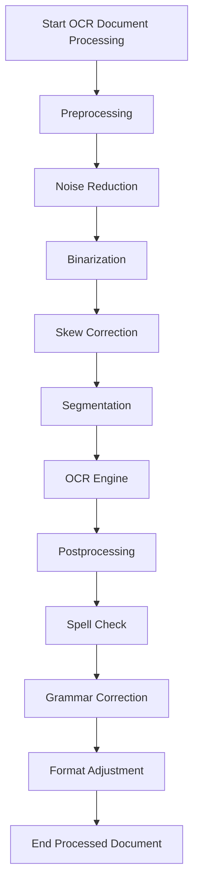

# OCR Document Processing Pipeline

This repository contains a Python implementation of an OCR (Optical Character Recognition) pipeline.

## OCR Pipeline Flowchart

Here is the flowchart that this project is based on. It outlines the sequential steps involved in processing a document.



## Project Structure

The project will be organized as follows:

```
.
├── src/
│   ├── preprocessing.py
│   ├── ocr.py
│   ├── postprocessing.py
│   └── main.py
├── tests/
│   ├── test_preprocessing.py
│   ├── test_ocr.py
│   └── test_postprocessing.py
├── requirements.txt
└── README.md
```

## Modules

### Preprocessing (`src/preprocessing.py`)
This module will contain functions for preparing the image for OCR.
- **Noise Reduction**: Removes unwanted artifacts from the image.
- **Binarization**: Converts the image to black and white.
- **Skew Correction**: Aligns the text in the image.
- **Segmentation**: Divides the document into lines or words.

### OCR Engine (`src/ocr.py`)
This module will use an OCR engine (like Tesseract) to extract text from the preprocessed image.

### Post-processing (`src/postprocessing.py`)
This module will contain functions for cleaning up the extracted text.
- **Spell Check**: Corrects spelling errors.
- **Grammar Correction**: Fixes grammatical mistakes.
- **Format Adjustment**: Adjusts the format to better match the original document.

## To-Do List

- [x] **Step 1: Create `README.md`**
- [ ] **Step 2: Set up the Python project**
  - [ ] Create `src` and `tests` directories
  - [ ] Create placeholder Python files
  - [ ] Create `requirements.txt`
- [ ] **Step 3: Implement the OCR pipeline**
  - [ ] Implement preprocessing functions
  - [ ] Implement OCR engine logic
  - [ ] Implement post-processing functions
- [ ] **Step 4: Create a main script**
- [ ] **Step 5: Write tests**
- [ ] **Step 6: Submit the final code**
