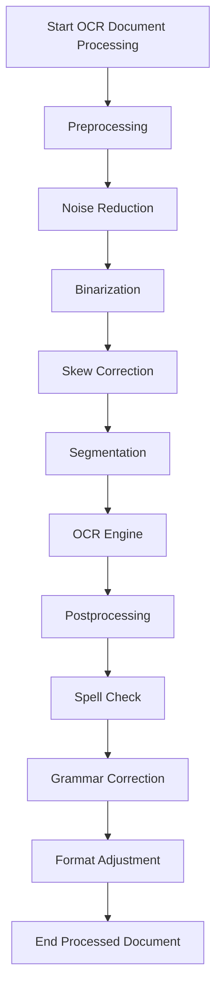

# OCR Document Processing Pipeline

This repository contains a Python implementation of an OCR (Optical Character Recognition) pipeline.

## OCR Pipeline Flowchart

Here is the flowchart that this project is based on. It outlines the sequential steps involved in processing a document.



## Usage

To run the OCR pipeline, use the `main.py` script. You must provide the path to an image file.

```bash
python3 src/main.py /path/to/your/image.png
```

### Selecting an Engine

You can choose between two different OCR engines using the `--engine` flag:

- `tesseract` (Default): A solid, widely-used OCR engine.
- `easyocr`: A deep-learning based engine that may provide higher accuracy.

Example:
```bash
# Run with EasyOCR
python3 src/main.py /path/to/your/image.png --engine easyocr
```

## Project Structure

The project is organized as follows:

```
.
├── src/
│   ├── preprocessing.py
│   ├── ocr.py
│   ├── postprocessing.py
│   └── main.py
├── tests/
│   ├── test_preprocessing.py
│   ├── test_ocr.py
│   └── test_postprocessing.py
├── requirements.txt
└── README.md
```

## Modules

### Preprocessing (`src/preprocessing.py`)
This module contains functions for preparing the image for OCR.
- **Noise Reduction**: Removes unwanted artifacts from the image.
- **Binarization**: Converts the image to black and white.
- **Skew Correction**: Aligns the text in the image.
- **Segmentation**: Divides the document into lines or words.

### OCR Engine (`src/ocr.py`)
This module provides a flexible interface to multiple OCR engines. The supported engines are:
- **Tesseract**: A popular, open-source OCR engine.
- **EasyOCR**: A deep-learning based OCR library known for its accuracy.

### Post-processing (`src/postprocessing.py`)
This module will contain functions for cleaning up the extracted text.
- **Spell Check**: Corrects spelling errors.
- **Grammar Correction**: Fixes grammatical mistakes.
- **Format Adjustment**: Adjusts the format to better match the original document.

## To-Do List

- [x] **Step 1: Refactor for Multi-Engine Support**
- [x] **Step 2: Integrate Tesseract Engine**
- [x] **Step 3: Integrate EasyOCR Engine**
- [x] **Step 4: Update Main Script for Engine Selection**
- [x] **Step 5: Update Documentation**
- [ ] **Step 6: Update Tests for All Engines**
- [ ] **Step 7: Submit Final Code**
